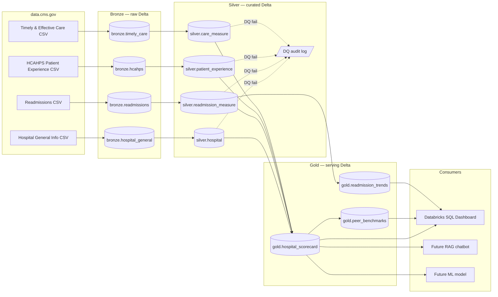

# Architecture & Design Decisions

This document explains *why* the lakehouse is structured the way it is. If the README is the elevator pitch, this is the architecture review a Principal Engineer would ask for.

## Guiding principles

Everything in this design traces back to five principles borrowed from my SRE / DBA background:

1. **Idempotency is non-negotiable.** Every notebook can be re-run end-to-end without corrupting state. No "did I already run this?" anxiety.
2. **Audit everything.** Every row carries ingest timestamp, source file, and batch ID. If a downstream consumer finds a bad number, we can trace it back to the source file in seconds.
3. **Fail loudly at the right layer.** Data quality checks live at Silver, not Gold. By the time data reaches Gold, we trust it — Gold consumers never see a "NULL where NOT NULL expected" surprise.
4. **Separate raw from curated.** Bronze is faithful to the source; changes to cleaning logic don't require re-downloading data. This is the same discipline as keeping a database backup separate from a transformed reporting copy.
5. **Partition / cluster for the query pattern, not the ingest pattern.** The dashboard queries by state and year; Gold is partitioned by state and Z-ordered on `year, hospital_id`.

## Medallion architecture



### Bronze — "the source of truth, not the source of transformation"

- **Schema:** same as the source CSV, with three extra audit columns: `_ingest_ts TIMESTAMP`, `_source_file STRING`, `_batch_id STRING`.
- **Write mode:** append-only with `_batch_id` tagging.
- **Why append and not overwrite?** If CMS publishes a revision, the old version is still recoverable. In the regulated industries I come from, "we overwrote the original file" is a career-ending answer during an audit.
- **No business logic.** No type casting beyond what Delta schema inference does. Bronze stays faithful so re-deriving Silver with a schema change means re-running `02_silver_clean`, not re-downloading anything.

### Silver — "trustworthy, queryable"

- **Strong typing.** `hospital_id` is `STRING` (CMS uses 6-char facility IDs, some starting with zeros — never `INT`). Dates are `DATE`. Scores are `DECIMAL(5,2)`. No silent `FLOAT` precision loss.
- **Deduplication.** `ROW_NUMBER() OVER (PARTITION BY hospital_id ORDER BY _ingest_ts DESC)` keeps the latest record per batch.
- **`MERGE INTO` for upserts.** Silver uses `MERGE` so the pipeline is incremental-ready (today full-refresh; tomorrow CDC-ready without reshaping).
- **Standardization.** State codes upper-cased. Hospital names trimmed. Measure names mapped to a controlled vocabulary in a lookup table.
- **Partitioning.** Silver tables are partitioned by `state` (30–60 partitions, good cardinality for the query workload).
- **Data quality.** See DQ section below. DQ failures are written to a `silver.dq_audit` table, not dropped silently.

### Gold — "serving layer for BI, ML, and agents"

- **Dimensional-ish.** Gold is denormalized for BI speed. One row per hospital per year in `hospital_scorecard`, with measure columns as peer-percentile-adjusted scores.
- **Peer benchmarks.** `peer_benchmarks` computes percentile rank within (state × bed-count-band × hospital-type). A small rural hospital is benchmarked against peers, not against Johns Hopkins.
- **Partitioning and Z-order.** Partitioned by `state`, Z-ordered on `(year, hospital_id)` — the access pattern for the dashboard and the future RAG chatbot.
- **`OPTIMIZE` + `VACUUM`.** Run after each full build so small-file problems don't accumulate on Community Edition's limited disk.

## Data quality strategy

Rather than pulling in a heavyweight framework (Great Expectations, Deequ) for a learning project, DQ is implemented in PySpark with a clear, extensible structure that mirrors how enterprise teams build it before adopting a tool.

### Check types

| Type | Example | Severity |
|---|---|---|
| **Schema contract** | `hospital_id` is non-null, unique | Hard fail — pipeline stops |
| **Null-rate threshold** | `readmission_rate` ≤ 15% null | Soft fail — row flagged, batch continues |
| **Range** | `overall_rating` between 1 and 5 | Soft fail — row flagged |
| **Referential integrity** | Every readmission row has a matching hospital | Hard fail |
| **Freshness** | Newest row within 90 days of expected | Warning only |
| **Volume** | Row count within ±10% of previous batch | Warning only |

### Output

Every batch produces a row in `silver.dq_run_summary`:
```
batch_id | run_ts | table | check | severity | result | rows_failed | sample_failures
```
Soft failures are also written to `silver.dq_failed_rows` with enough context (hospital_id, batch_id, failing column) to reproduce the issue.

### Why this matters

In my DBA world, the equivalent is "a reliable backup-verification job that doesn't just say 'backup succeeded' but actually *restores* the backup weekly." DQ in a lakehouse plays the same role: the pipeline should tell you loudly and early when the data coming in is different from the data it was designed for.

## Reliability patterns

Where the DBA / SRE instincts show up in this codebase:

- **Every write is idempotent.** Notebooks can be re-run without double-writes. `MERGE INTO` handles upserts; Bronze append uses `_batch_id` to skip already-ingested files.
- **Audit columns everywhere.** `_ingest_ts`, `_source_file`, `_batch_id` on every Bronze row. Silver/Gold carry `_silver_ts` / `_gold_ts`.
- **Config is centralized.** `notebooks/00_setup.py` defines catalog, schema, volume paths, and constants once. Downstream notebooks import, not duplicate.
- **Notebook order is documented and enforced.** `00` → `05`. Each notebook asserts its upstream tables exist and fails fast if they don't.
- **Secrets never in notebooks.** Community Edition doesn't use secrets much, but the pattern is preserved: anywhere a token would live, a comment points to `dbutils.secrets.get(...)` for production use.
- **`describe history` is your `fn_dblog`.** Delta Lake's transaction log is a first-class DBA tool. Time travel is used in the DQ audit table to reconstruct "what did the data look like last Tuesday at 3am."

## Partitioning & performance

| Layer | Partition column | Cluster / Z-order | Rationale |
|---|---|---|---|
| Bronze | `_batch_date` (DATE) | — | Ingest-pattern aligned; makes replaying a batch a partition overwrite. |
| Silver | `state` (STRING) | `_silver_ts` | Query pattern is state-filtered; 50-ish partitions is healthy. |
| Gold | `state` (STRING) | `year, hospital_id` | Dashboard filters by state + year; BI tool access pattern. |

Small-file management: `OPTIMIZE` runs at the end of each notebook; `VACUUM` weekly (or manually on Community Edition) to reclaim space.

## What this design explicitly *does not* do (and why)

- **No streaming on the first pass.** CMS data updates quarterly at best. Adding Structured Streaming or Auto Loader here would be over-engineering. It's on the roadmap for the subset that updates more often.
- **No Delta Live Tables.** DLT is great but hides the machinery; I want the first pass to show explicit Delta mechanics (`MERGE`, `OPTIMIZE`, history, etc.). DLT conversion is in the roadmap.
- **No Unity Catalog RBAC detail.** Community Edition doesn't support Unity Catalog fully. Production deployment notes in `SETUP.md`.
- **No feature store or MLflow yet.** Those belong to Project #2 (the readmission-risk model and the RAG chatbot).

## Trade-offs I'd revisit at production scale

- **Partition by state** works for ~5,000 US hospitals but wouldn't scale to all providers. A multi-level `(country, state)` would be the obvious evolution.
- **Full-refresh silver** is fine at this volume but a CDC or `MERGE`-with-watermark approach would be worth the complexity at billions of rows.
- **Single-catalog** layout is fine for a learning project; a production version would split `dev` / `prod` catalogs with Unity Catalog access controls.

---

*See [`SETUP.md`](./SETUP.md) for how to run it, and [`BUILD_PLAN.md`](./BUILD_PLAN.md) for the ~25-hour build schedule.*
