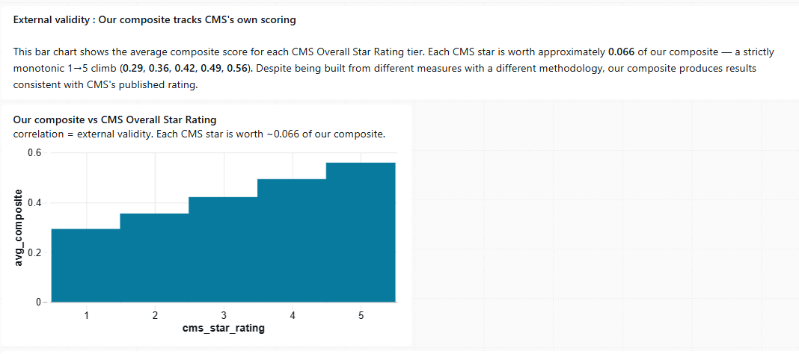
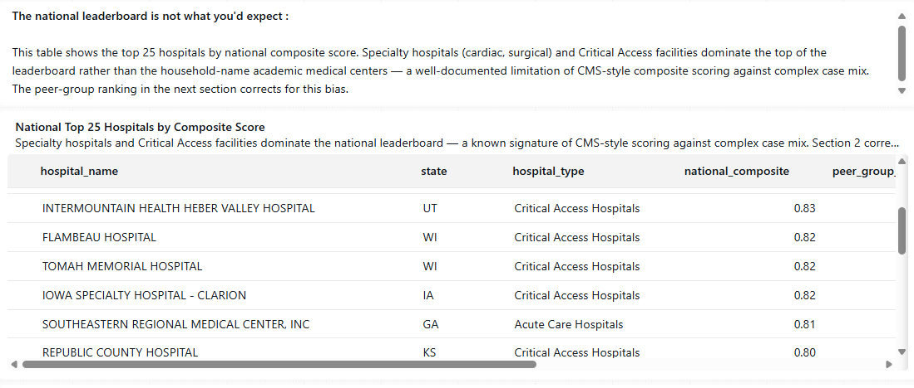
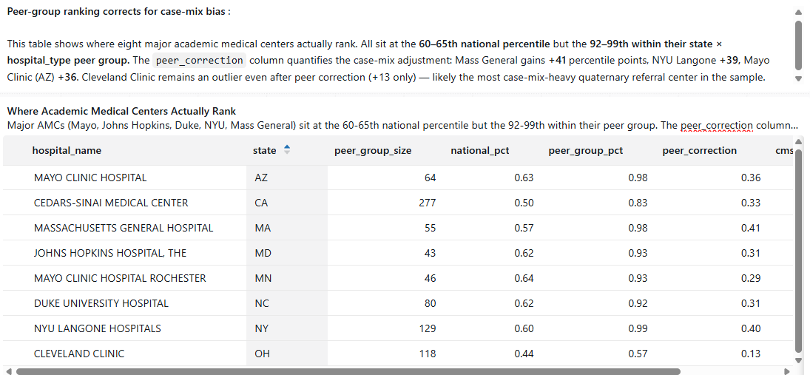

# CMS Hospital Quality Lakehouse

> A production-style medallion lakehouse on Databricks that ingests public CMS Hospital Care Compare data, cleans and validates it, and produces a composite hospital quality scorecard with national and peer-group percentile ranking — validated against CMS's own published Overall Star Rating.


---

## What this looks like

The composite scoring built in this lakehouse correlates monotonically with CMS's own published Overall Star Rating despite being built from different measures with a different methodology. Each CMS star is worth approximately 0.066 of the composite (1-star avg = 0.29, 5-star avg = 0.56), and the climb is strictly monotonic across all five rating tiers.



That's the external-validity check: an independent composite, built from polarity-aware percentile ranks across HRRP readmissions, HCAHPS patient experience, and CMS care quality measures, produces results consistent with what CMS itself publishes. The full live dashboard adds two more sections that complete the story.

**[Live Databricks SQL dashboard](https://dbc-7e24427c-1178.cloud.databricks.com/dashboardsv3/01f14e5e11de125bae8ca628c2e290cd/published?o=7474657504228097)** *(viewing requires a Databricks account)*

## Why I built this

I spent two decades running data systems that couldn't go down — eight years as a SQL Server DBA at PointClickCare keeping HIPAA-regulated healthcare data alive, and the last five years leading SRE for the enterprise SQL Server DBaaS platform at Citigroup. The discipline is reliability work: 4,000+ databases, 14TB+ under management, Always On clusters, automated patching, root-cause analysis at 3am.

This project is how I'm translating that operational data-infrastructure background into modern data engineering — same discipline (HA, data quality, reliability, documentation) applied to a lakehouse stack instead of an OLTP estate.

The dataset is the same shape of data I knew at PointClickCare, except public: hospital quality metrics, readmission rates, patient experience scores, and timely-care measures published by the Centers for Medicare & Medicaid Services. The kind of data a hospital executive or healthcare payer would want aggregated, benchmarked, and refreshed reliably.

## What this project demonstrates

| Capability | Evidenced by |
|---|---|
| Medallion (Bronze / Silver / Gold) lakehouse design | Three-tier pipeline under `notebooks/` |
| Delta Lake write patterns | Schema enforcement, `MERGE` upserts, idempotent rebuilds, `OPTIMIZE` + liquid clustering |
| PySpark data engineering | Notebooks 02 through 04, with polarity-aware percentile ranking and threshold-gated composites |
| Data quality engineering | 26 DQ checks across 5 reusable functions; persisted run summary; HARD-fail gating |
| Modeling for analytics | Composite scoring matching CMS publication standards (minimum-measure thresholds per domain) |
| External validity | Monotonic correlation with CMS Overall Star Rating across all 5 rating tiers |
| Honest data interpretation | Peer-group ranking column explicitly addresses case-mix bias in CMS-style composites |
| Reliability mindset | Idempotent notebooks, audit columns, MERGE-based upserts, smoke tests in every Gold rebuild |
| Databricks SQL + dashboarding | 10 reference queries under `sql/`; published dashboard with section-divided narrative |
| Professional documentation | This README, `ARCHITECTURE.md`, `BUILD_PLAN.md`, `SETUP.md`, `docs/data_dictionary.md` |

## Key findings

The lakehouse surfaced several patterns that are documented in the academic literature but rarely shown plainly. Three worth flagging:

**1. The national leaderboard is not what you'd expect.** Specialty hospitals (cardiac, surgical) and Critical Access Hospitals dominate the top of the raw national composite — not the household-name academic medical centers.



This isn't a bug; it's a well-documented limitation of CMS-style composite scoring. Specialty hospitals handle selected patient cohorts with predictable conditions, and CAHs have low patient volumes with simpler case mix — both score well on measure-level outcomes even when the care delivered at large quaternary referral centers may be objectively better per case.

**2. Peer-group ranking corrects for case-mix.** Ranking each hospital within its `(state, hospital_type)` cohort rather than against the full national population produces a fairer comparison. Major academic medical centers — Mayo Clinic Rochester, Johns Hopkins, Duke, NYU Langone, Mass General — sit at the 60-65th national percentile but the 92-99th within their peer group.



The `peer_correction` column quantifies the case-mix adjustment: Mass General gains 41 percentile points, NYU Langone 39, Mayo Clinic (AZ) 36. Cleveland Clinic remains an outlier even after peer correction (only +13 points, ending at the 57th percentile) — likely the most case-mix-heavy quaternary referral center in the sample. Surfacing that honestly was deliberate.

**3. Only 55.9% of hospitals are nationally rankable.** The Gold layer applies CMS-style minimum-measure thresholds (≥2 of 4 broad HRRP measures, all 3 HCAHPS stars, ≥3 of 4 care measures) before computing a domain composite, and requires ≥2 qualified domains before computing a top-line composite. This means 3,029 of 5,418 hospitals get a national rank — consistent with the coverage CMS publishes for its own Overall Star Rating. The rest stay in the table with their per-measure values intact, flagged but not ranked. Preserving the "data desert" signal rather than fabricating ranks from a single measure was the central design decision of the Gold layer.

## Architecture at a glance

```
                ┌──────────────────────┐
                │  data.cms.gov CSVs   │
                │  (public, no auth)   │
                └──────────┬───────────┘
                           │ download
                           ▼
┌──────────────────────────────────────────────────────────┐
│                     BRONZE  (raw)                        │
│  As-ingested Delta tables; schema preserved, no edits.   │
│  Adds: _ingest_ts, _source_file, _batch_id               │
└──────────────────────┬───────────────────────────────────┘
                       │  typed casts, dedupe, suppression flags
                       ▼
┌──────────────────────────────────────────────────────────┐
│                    SILVER  (curated)                     │
│  Strongly-typed, deduped, MERGE-upserted, liquid-        │
│  clustered. Suppression-aware (CMS publishes NULLs as    │
│  explicit boolean flags, not silent NULLs).              │
│  Enforced by 26-check DQ harness with persistent audit.  │
└──────────────────────┬───────────────────────────────────┘
                       │ polarity-aware percentile ranks,
                       │ threshold-gated composites
                       ▼
┌──────────────────────────────────────────────────────────┐
│                      GOLD  (serving)                     │
│  • gold_hospital_scorecard                               │
│    One row per (hospital_id, snapshot_year), with:       │
│    - Per-measure values for 14 quality metrics           │
│    - Three domain composites (readmission, HCAHPS, care) │
│    - National + peer-group percentile ranks              │
│    - Provenance: three explicit as-of windows            │
└──────────────────────┬───────────────────────────────────┘
                       │
                       ▼
        Databricks SQL Dashboard  +  (future) RAG chatbot
```

See [`ARCHITECTURE.md`](./ARCHITECTURE.md) for the design rationale — why medallion, why Delta, partition/cluster choices, data-quality strategy, and the reliability patterns borrowed from my SRE background.

## Outcomes

- **5,418 hospitals** ingested across 4 CMS source tables into the Bronze Delta layer; idempotent re-runs verified via `_batch_id` audit column.
- **26 data-quality expectations** in the Silver layer (null thresholds, range checks, referential integrity, freshness, primary-key uniqueness) across 5 reusable check functions; results persisted to a `dq_run_summary` Delta table for audit and trending. 25/26 checks pass on the current data; 1 SOFT warning on the `overall_rating` null rate is the explicit signature of CMS suppression and validated as expected, not a defect.
- **Composite scoring methodology** matches CMS's own publication gating: minimum 2-of-4 broad HRRP measures, all 3 HCAHPS stars, minimum 3-of-4 care measures per domain; minimum 2 qualified domains for top-line. **55.9% of hospitals (3,029 of 5,418)** qualify for national ranking, in line with CMS's own coverage.
- **External validity confirmed:** average composite increases monotonically across all five CMS Overall Star Rating tiers (0.29 → 0.36 → 0.42 → 0.49 → 0.56). Each CMS star is worth approximately 0.066 of the composite.
- **Peer-group correction:** within state × hospital_type cohorts, eight major academic medical centers move from 60-65th national percentile to 92-99th peer-group percentile, quantifying the case-mix bias inherent to CMS-style composite scoring.
- **Gold table optimized for BI queries:** liquid clustering on `(state, hospital_type, snapshot_year)`; MERGE-based incremental writes; sub-second response on dashboard queries.
- **Published dashboard** with three section-divided tiles delivering the national-validity → leaderboard-surprise → peer-group-resolution narrative.

## Tech stack

- **Compute & runtime:** Databricks Free Edition, Databricks Runtime 18.1 serverless
- **Storage format:** Delta Lake with liquid clustering
- **Governance:** Unity Catalog (catalog/schema/volume hierarchy)
- **Languages:** PySpark (Python 3.10+), Databricks SQL
- **Source control:** Git / GitHub with Databricks Git folders
- **Visualization:** Databricks SQL Dashboards (Lakeview)
- **Data source:** [CMS Care Compare datasets](https://data.cms.gov/provider-data/) — Hospital General Information, HRRP (Hospital-Level Readmissions Reduction Program), HCAHPS (Patient Experience), Timely and Effective Care

## Repository layout

```
cms-hospital-lakehouse/
├── README.md                          ← you are here
├── ARCHITECTURE.md                    ← design rationale, partitioning, DQ strategy
├── SETUP.md                           ← one-time Databricks + Git setup
├── BUILD_PLAN.md                      ← hour-by-hour ~25-hour build plan
├── LICENSE                            ← MIT
├── notebooks/
│   ├── 00_setup.py                    ← catalog, schema, volume, config
│   ├── 01_bronze_ingest.py            ← download CMS CSVs, land as Delta Bronze
│   ├── 02_silver_clean.py             ← cast, dedupe, MERGE into Silver
│   ├── 03_silver_dq_checks.py         ← 26 DQ checks across 5 reusable functions
│   ├── 04_gold_scorecard.py           ← Gold composite scorecard with peer-group ranking
│   └── 05_gold_benchmarks.py          ← (scaffolded - in progress)
├── sql/
│   ├── gold_scorecard_dev_view.sql    ← standalone dev view of the Gold transformation
│   └── dashboard_queries.sql          ← 10 reference queries powering the dashboard
├── docs/
│   ├── data_dictionary.md             ← field-level schema documentation
│   ├── linkedin_post_template.md      ← project announcement post draft
│   └── screenshots/                   ← dashboard screenshots embedded above
├── notes/
│   ├── week1.md                       ← Weekend 1 retrospective (Bronze)
│   ├── week2.md                       ← Weekend 2 retrospective (Silver)
│   └── week3.md                       ← Weekend 3 retrospective (DQ + Gold) - coming
```

## How to reproduce

1. **One-time setup:** follow [`SETUP.md`](./SETUP.md) (Databricks Free Edition, Git folder, data download).
2. **Build order:** run notebooks `00` → `04` in order. Each notebook is idempotent; you can re-run freely. The Gold layer rebuilds via MERGE, so re-running updates rather than appends.
3. **Dashboard:** open `sql/dashboard_queries.sql` in Databricks SQL Editor and build visualizations from the provided queries, or clone the published dashboard structure.
4. **Full walkthrough:** see [`BUILD_PLAN.md`](./BUILD_PLAN.md).

## Future work

The lakehouse is the foundation. The plan is to layer these on top, one at a time:

- [ ] **05_gold_benchmarks notebook** — peer-benchmark percentile tables broken out by region, size, and ownership type
- [ ] **Orchestration** — Databricks Workflow with scheduled monthly refresh and failure alerts
- [ ] **Streaming ingestion** — Auto Loader + Delta Live Tables for datasets that update more frequently than CMS's monthly cycle
- [ ] **Feature store** — register the scorecard features in Databricks Feature Store
- [ ] **ML: readmission-risk model** — gradient boosted model predicting readmission risk from the Silver layer; tracked with MLflow
- [ ] **RAG chatbot over quality data** — embed hospital profiles with Databricks Vector Search; natural-language queries like *"Which Virginia hospitals have the best heart-attack outcomes?"*
- [ ] **Observability** — pipeline metrics to a Grafana dashboard (leveraging the SRE background)
- [ ] **Terraform** — manage the workspace, cluster, and permissions as code

## About the author

**Hajera Khan** — Senior Data Platform Engineer & SRE. 20+ years running mission-critical data systems across HIPAA and financial-services regulated environments. Currently leading SRE for the enterprise SQL Server DBaaS platform at Citigroup; actively transitioning into modern data engineering and AI data pipelines.

- LinkedIn: [hajerakhan](https://www.linkedin.com/in/hajerakhan)
- Based in Chantilly, VA · US Citizen · Open to hybrid / remote

## License

MIT — see [`LICENSE`](./LICENSE). Data used is public-domain CMS data; please review CMS terms of use on [data.cms.gov](https://data.cms.gov/).

---

*Built as part of a deliberate pivot from SQL Server DBA / SRE into modern data engineering and AI data pipelines. Feedback welcome — open an issue or reach out on LinkedIn.*
